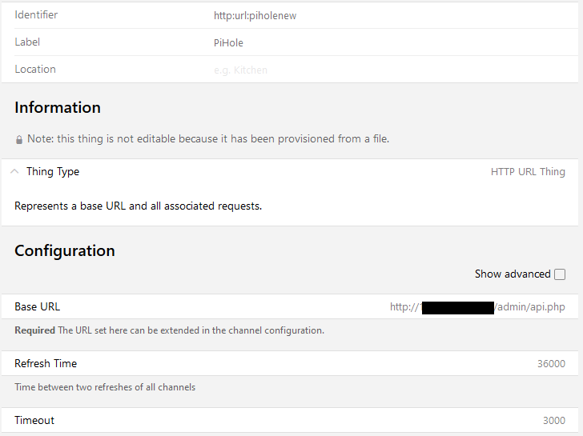
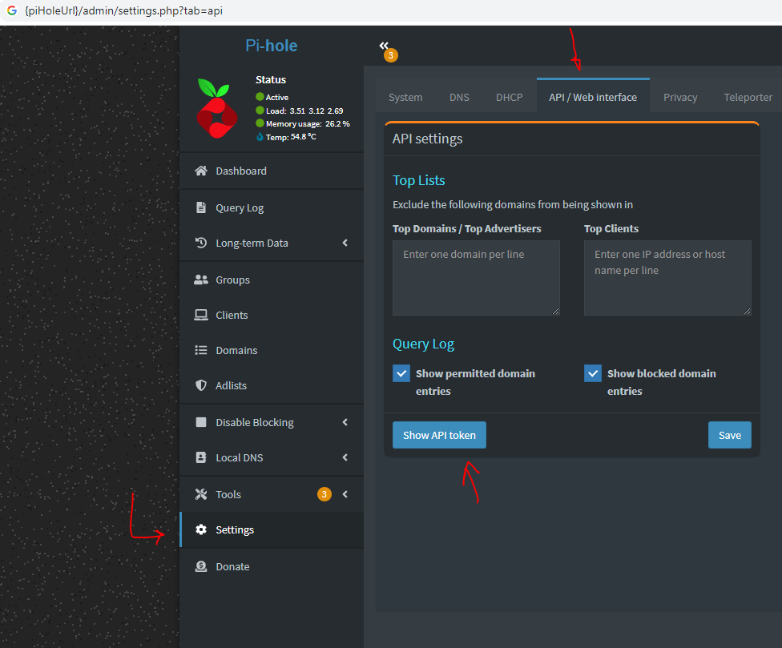

`openhab3` 
# openhab3 pihole Integration

# Requirements

1. Working [openhab3](https://www.openhab.org/) setup
1. [HTTP-Binding](https://www.openhab.org/addons/bindings/http/) installed
1. [JSON-Path-Transormation](https://www.openhab.org/addons/transformations/jsonpath/) installed


# How To

1. Add a new HTTP-Thing and configure it like shown in the image below

1. Add a `pihole.things` file to your openHab3 config
1. Add all paths you later want to display in a sitemap as a channel
    * an example can be found [here](pihole.things)
1. Add a `pihole.items` file to your openHab3 config
1. Create an item for each value you want to display or use in openHab
    * an example can be found [here](pihole.items)
1. Create a Sitemap and display the pihole values like shown in the image below
    * an example for the sitemap below can be found [here](pihole.sitemap)


## PiHole Authentication

If your PiHole instance uses a web interface password, further authentication is required in `pihole.things` file. <br/>
Original PiHole BlogPost: [PiHole BLog Announcement](https://pi-hole.net/blog/2022/11/17/upcoming-changes-authentication-for-more-api-endpoints-required/)

### How to add Authentication

1. Get your API Token from PiHole Instance: {piHoleUrl}/admin/settings.php?tab=api </br> </br>


2. Change your baseUrl in  `pihole.things` file in your openHab3 config.


```
Thing http:url:piholenew "PiHole" [ baseURL="http://{piHoleUrl}/admin/api.php?summary&auth={RawApiToken}", refresh=36000] {
    Channels:
        Type string : DomainsBlocked        "Domains Blocked"          [ stateTransformation="JSONPATH:$.domains_being_blocked" ]
        Type string : QueriesToday          "Queries Today"            [ stateTransformation="JSONPATH:$.dns_queries_today" ]
        Type string : AdsBlockedToday       "ADS Blocked Today"        [ stateTransformation="JSONPATH:$.ads_blocked_today" ]
        Type string : AdsPercentageToday    "ADS Percentage Today"     [ stateTransformation="JSONPATH:$.ads_percentage_today" ]
        Type string : UniqueDomains         "Unique Domains"           [ stateTransformation="JSONPATH:$.unique_domains" ]
        Type string : QueriesForwarded      "Queries QueriesForwarded" [ stateTransformation="JSONPATH:$.queries_forwarded" ]
        Type string : QueriesCached         "Queries Cached"           [ stateTransformation="JSONPATH:$.queries_cached" ]
        Type string : UniqueClients         "Unique Clients"           [ stateTransformation="JSONPATH:$.unique_clients" ]
        Type string : ClientsEverSeen       "Clients ever seen"        [ stateTransformation="JSONPATH:$.clients_ever_seen" ]
        Type string : DomainsBlocked        "DNS Queries all Types"    [ stateTransformation="JSONPATH:$.domains_being_blocked" ]
        Type string : Status                "Status"                   [ stateTransformation="JSONPATH:$.status" ]
}

```
{RawApiToken} is copied from Step1 using the 'Show API Token' Button.

Please note: Add `?summary` as an additional query parameter to query the PiHole endpoint for the configured json structure from your `pihole.things` configuration.


